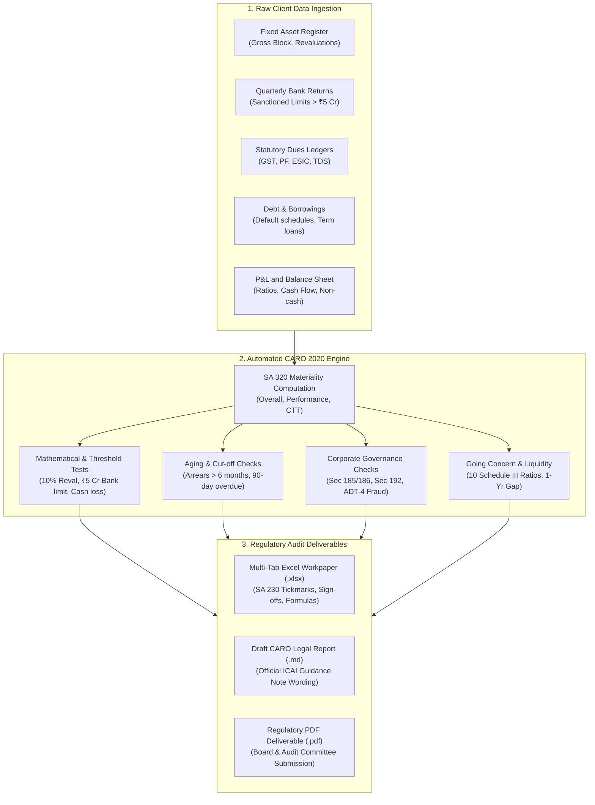

# CARO 2020 Substantive Audit Testing Engine

[](https://www.python.org/downloads/)
[](https://opensource.org/licenses/MIT)
[](https://www.icai.org/)
[](https://nfra.gov.in/)

> **An automated substantive audit testing engine for statutory auditors under CARO 2020 (Companies Auditor's Report Order) and Section 143(11) of the Companies Act, 2013.**  
> Built for Big 4 audit engagement teams (PwC, Deloitte, EY, KPMG), top chartered accountancy firms, and financial analysts in India.

---

## 🌟 Why This Project Matters

In statutory audits in India, audit engagement teams at Big 4 and top CA firms are legally mandated to report on **CARO 2020 (Companies Auditor's Report Order)**, which comprises **21 specific audit clauses** covering everything from fixed asset title deeds and loan defaults to unpaid taxes, fraud, real cash losses, and going concern risks.

Today, audit teams test these 21 clauses manually:
- They collect raw client schedules (Fixed Asset Registers, bank statements, ledger extracts, GST/PF returns, debt amortization tables).
- They cross-reference numbers by hand and fill out static checklists.
- Because audit regulators (**NFRA** and **ICAI**) heavily inspect audit files, firms face severe penalties if their workpapers cannot mathematically prove how each clause was independently verified.

**This engine replaces manual checklists with automated, mathematically verifiable substantive testing.**

---

## 🏗️ Architecture & Workflow



---

## 📋 Comprehensive Coverage of All 21 CARO 2020 Clauses

| Clause | Audit Subject | Substantive Test & Statutory Threshold |
| :--- | :--- | :--- |
| **Clause 3(i)** | PPE & Intangible Assets | Title deeds verification, **10% Revaluation threshold**, Registered Valuer per Sec 247, Benami checks. |
| **Clause 3(ii)** | Inventories & Working Capital | Inventory count coverage (**10% discrepancy limit**), Bank stock returns reconciliation (**Limit > ₹5 Cr**). |
| **Clause 3(iii)**| Loans, Guarantees & Securities | Group entity loan segregation, terms prejudicial, **overdue > 90 days**, loan evergreening & demand loans %. |
| **Clause 3(iv)** | Sec 185 & 186 Compliance | Loans to directors prohibition (Sec 185) and investment/guarantee statutory ceiling checks (Sec 186). |
| **Clause 3(v)**  | Public Deposits | Compliance with Sections 73 to 76, RBI directives, deposit repayment reserve, CLB/NCLT orders. |
| **Clause 3(vi)** | Cost Records | Broad review of cost records maintained under Section 148(1) per ICAI Guidance Note. |
| **Clause 3(vii)**| Statutory Dues & Litigations | Undisputed arrears **unpaid > 6 months as of March 31**; Disputed tax litigations organized by appellate forum. |
| **Clause 3(viii)**| Undisclosed Income | Tax search/survey surrendered income under Income Tax Act, 1961 recorded in books of account. |
| **Clause 3(ix)** | Borrowings Defaults & End-Use | Lender-wise default tracking, wilful defaulter queries, term loan diversion, short-term funds for long-term CapEx. |
| **Clause 3(x)**  | IPO/FPO & Private Placement | Public issue end-use, Section 42 & 62 compliance for preferential allotment / convertible debentures. |
| **Clause 3(xi)** | Fraud Reporting | Fraud noticed/reported, **Form ADT-4 filed with Central Govt (Sec 143(12))**, Whistleblower complaints considered. |
| **Clause 3(xii)**| Nidhi Company Ratios | Net Owned Funds to Deposits ratio (1:20), 10% unencumbered term deposits, default in deposits. |
| **Clause 3(xiii)**| Related Party Transactions | Audit Committee approval (Sec 177), Board approval (Sec 188), arm's length benchmarking, Ind AS 24 Note disclosures. |
| **Clause 3(xiv)**| Internal Audit System | Commensurate with size/nature (Sec 138), internal audit reports reviewed and considered per SA 610. |
| **Clause 3(xv)** | Non-Cash Transactions | Asset transfers to/from directors without cash consideration; Section 192 compliance and general meeting approvals. |
| **Clause 3(xvi)**| RBI NBFC & CIC Registration | 50-50 principal business test under Section 45-IA of RBI Act, Core Investment Company (CIC) status and group count. |
| **Clause 3(xvii)**| Real Cash Losses Recalculation | Recalculates cash loss: $PBT + \text{Depreciation} + \text{Amortization} + \text{Non-cash Items}$ for CY and PY. |
| **Clause 3(xviii)**| Resignation of Statutory Auditor| Consideration of Form ADT-3, issues or concerns raised by outgoing auditors per SA 300. |
| **Clause 3(xix)**| Going Concern Capability | 10 Schedule III financial ratios, 1-year asset-liability maturity gap, undrawn credit lines, SA 570 evaluation. |
| **Clause 3(xx)** | CSR Compliance (Sec 135) | Sec 135(5) transfer to Schedule VII fund within **6 months**; Sec 135(6) transfer to Special Account within **30 days**. |
| **Clause 3(xxi)**| CFS CARO Qualifications | Aggregation of qualifications and adverse remarks reported in CARO annexures of group subsidiaries. |

---

## 🏢 Real Listed Company Samples

This repository includes two real-world corporate datasets for end-to-end substantive audit verification:

1. **Tata Motors Limited (FY 2023-24)**
   - **Scale:** Large listed manufacturer (Turnover: ₹73,289.00 Crore).
   - **Results:** 16 Clean clauses, 2 Observations (Title deeds pending mutation post-amalgamation, quarterly bank statement timing adjustments), 1 Qualification (Undisputed municipal tax arrears > 6 months: ₹3.30 Cr).
2. **Zenith Infrastructure & Power Limited (FY 2023-24)**
   - **Scale:** Stressed listed EPC infrastructure company (Turnover: ₹4,250.00 Crore).
   - **Results:** 16 Qualified clauses, 39 Audit Exceptions flagged, ₹2,342.35 Crore in quantified financial exposure, demonstrating adverse CARO reporting, cash loss disclosures, bank returns variances (> 16%), and material uncertainty on going concern.

---

## 🚀 Quickstart Guide

### 1. Installation
Clone the repository and install in editable mode:
```bash
git clone https://github.com/your-username/caro2020-audit-engine.git
cd caro2020-audit-engine
pip install -e .
```

### 2. Run Audit via CLI
Run the automated substantive testing engine on Tata Motors Limited:
```bash
caro-audit audit --client data/sample_clients/tata_motors_fy24
```
Or test the stressed scenario with adverse remarks:
```bash
caro-audit audit --client data/sample_clients/zenith_infra_fy24
```

### 3. Launch Interactive Streamlit Web Dashboard
Launch the web interface for visual clause inspection and one-click deliverable downloads:
```bash
streamlit run src/app.py
```

### 4. Run Test Suite
Run the automated test suite with pytest:
```bash
pytest tests/ -v
```

---

## 📦 Audit Deliverables Generated

The engine automatically generates three audit deliverables in the client's `deliverables/` folder:

1. **`[Client]_CARO_2020_Workpaper.xlsx` (Multi-Tab Excel Workpaper):**
   - **Lead Sheet & Materiality:** SA 320 materiality calculation (Overall, Performance, CTT), clause breakdown dashboard, SA 230 tickmarks legend, and formal auditor review/sign-off blocks.
   - **CARO Clause Matrix:** Master audit testing table with status badges and procedure documentation.
   - **Statutory Schedules:** Dedicated tabs for Title Deeds (Clause i(c)), Bank Returns Reconciliation (Clause ii(b)), Statutory Dues (Clause vii), and Going Concern Ratios (Clause xix).
   - **Consolidated Exceptions Log:** Consolidated log of audit exceptions with quantified exposure amounts and severity ratings.
2. **`[Client]_Draft_CARO_Report.md` (Legal Annexure):**
   - Standard ICAI Guidance Note wording for the Independent Auditor's Report, auto-inserting required statutory disclosure tables.
3. **`[Client]_CARO_2020_Report.pdf` (Regulatory PDF):**
   - Formal, printable PDF report generated via ReportLab suitable for presentation to the Audit Committee and Board of Directors.

---

## 🏷️ Big 4 Standard Tickmarks (SA 230)

| Tickmark | Meaning per ICAI SA 230 / SA 500 |
| :---: | :--- |
| **`✓`** | **Vouched:** Verified against primary documentary evidence (invoices, deeds, agreements). |
| **`Σ`** | **Cast Verified:** Mathematically cast and cross-cast recalculated by software without exception. |
| **`Φ`** | **External Reconciled:** Reconciled with independent 3rd party confirmation or bank returns per SA 505. |
| **`λ`** | **Statutory Limit:** Substantively tested against legal thresholds prescribed under Companies Act / CARO 2020. |
| **`GL`** | **Ledger Tied:** Tied directly to audited Trial Balance / General Ledger closing balances as of March 31. |
| **`X`** | **Exception Flagged:** Audit discrepancy detected exceeding tolerable statutory threshold. |
| **`Δ`** | **Document Inspected:** Inspected minutes, board approvals, or external legal documentation per SA 250. |

---

## 📄 License
This project is licensed under the MIT License - see the LICENSE file for details.
